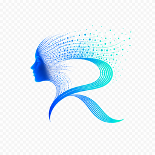

# ROMA AI — Specs de Animación del Logo
## Para implementación futura con Canvas/JS

---

## Estado actual (implementado)

- **Navbar**: `logo-roma-symbol.png` a 44px de alto + texto "ROMA AI"
  - Animación CSS `logo-reveal` al cargar (1.4s, blur → focus → scale)
  - Animación CSS `logo-glow` continua (pulso teal/azul cada 3s)
- **Footer**: `logo-roma-full.png` a 90px de alto
  - Animación CSS `logo-glow` continua

---

## Animación completa pendiente — Opción 1 (recomendada por brand guide)
### "Partículas → Perfil → Pulso constante"

### Fase 1 — Partículas dispersas (0s – 0.8s)
```
- ~250 partículas circulares (radio: 1.5–3px)
- Colores: #4f6ef7 y #00e5bf alternadas (70/30)
- Posición inicial: random dentro de área 200×200px (centrada en el logo)
- Opacidad inicial: 0, fadeIn a 0.8 durante 0.3s
- Movimiento: cada partícula en posición random, quieta pero con micro-jitter (±2px)
```

### Fase 2 — Convergencia al perfil (0.8s – 2.0s)
```
- Las partículas se mueven hacia sus posiciones "target" 
  (que forman el perfil de la cara + la letra R)
- Easing: cubic-bezier(0.22, 1, 0.36, 1) — rápido al inicio, suave al llegar
- Las partículas externas llegan primero, las internas después (stagger de 200ms)
- Al llegar: brightness aumenta 1.4x brevemente (bounce de luz)
```

### Fase 3 — Logo completo aparece (2.0s – 2.8s)
```
- El PNG del logo hace crossfade sobre las partículas (opacity 0 → 1)
- Las partículas hacen fadeOut simultáneamente
- El logo aparece con filter: blur(4px) → blur(0) durante 0.8s
- Scale: 0.96 → 1.0
```

### Fase 4 — Pulso constante (2.8s → ∞)
```css
@keyframes logo-glow-full {
  0%, 100% {
    filter: drop-shadow(0 0 10px rgba(0,229,191,0.35))
            drop-shadow(0 0 20px rgba(79,110,247,0.2));
  }
  50% {
    filter: drop-shadow(0 0 22px rgba(0,229,191,0.65))
            drop-shadow(0 0 40px rgba(79,110,247,0.35));
  }
}
/* Duración: 3s, ease-in-out, infinite */
```

---

## Tamaños de referencia exactos

| Uso | Archivo | Tamaño display | Original |
|-----|---------|---------------|---------|
| Navbar | `logo-roma-symbol.png` | **44px alto × auto ancho** | 1254×1254px |
| Footer | `logo-roma-full.png` | **90px alto × auto ancho** | 1254×1254px |
| Hero standalone | `logo-roma-dark.png` | **200px alto × auto ancho** | 1254×1254px |
| Horizontal (futuro) | `logo-roma-horizontal.png` | **40px alto × auto ancho** | 1672×941px |

---

## Implementación Canvas sugerida

```html
<!-- En el <head> -->
<canvas id="logo-canvas" width="200" height="200"></canvas>

```

```js
// Posiciones target de las partículas (se obtienen leyendo los píxeles del PNG)
// 1. Cargar logo-roma-symbol.png en canvas offscreen
// 2. getImageData() para extraer píxeles no-transparentes
// 3. Samplear cada N píxeles como "posición target" de una partícula
// 4. Animar convergencia con requestAnimationFrame
// Librería sugerida: tsParticles o implementación custom con Canvas API
```

---

## Assets disponibles en /assets/

```
logo-roma-symbol.png      ← Solo el símbolo R+cara (transparent bg)
logo-roma-full.png        ← Logo completo cuadrado (transparent bg)
logo-roma-horizontal.png  ← Logo horizontal (transparent bg)
logo-roma-dark.png        ← Logo sobre fondo oscuro #050816 (opaque)
```

---
*Creado: 2026-05-28*
