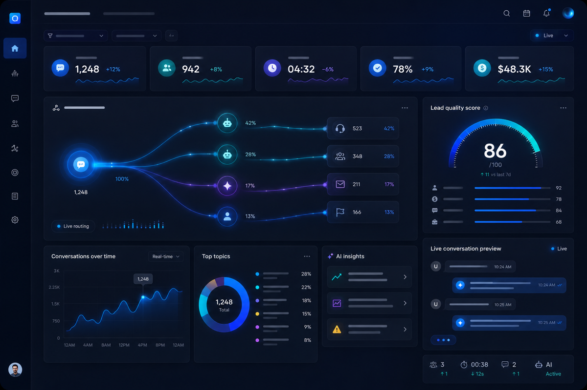
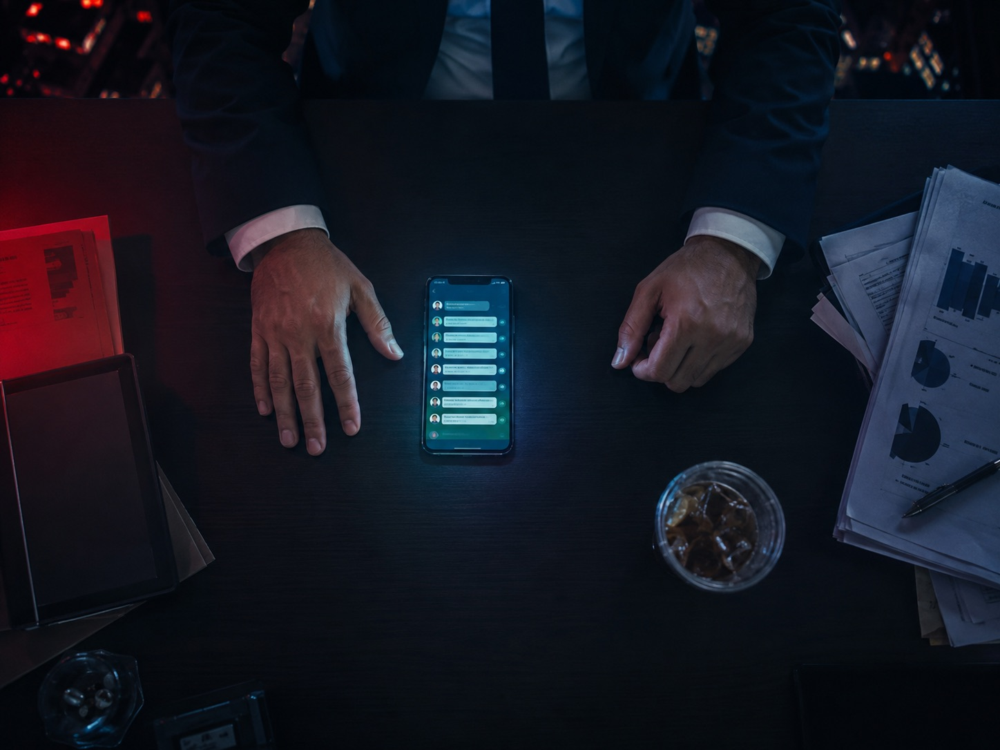

# ROMA AI — Web Landing Brainstorm Expandido

## Documento de Diagnóstico, Estrategia y Propuestas para la Nueva Landing

**Versión:** 1.0  
**Fecha:** 2026-05-28  
**URL Producción:** <https://roma.dementetv.com/>
**Archivo base:** `index.html` (1903 líneas, HTML/CSS/JS vanilla)  
**Objetivo:** Diagnóstico brutal + dirección estratégica para ROMA AI 3.0 Web

---

## 1. Diagnóstico Brutalmente Honesto

### Qué funciona

**El sistema de color es coherente y tiene identidad.** El uso de `--bg-deep: #050816`, `--primary: #4f6ef7` (azul-índigo) y `--accent: #00e5bf` (verde menta) crea una paleta oscura que se siente tecnológica sin caer en el negro puro genérico. La tercera variable `--purple: #a78bfa` agrega profundidad a los gradients sin romper la harmonía. Este sistema de tokens CSS en `:root` es el activo visual más sólido del proyecto.

**El hero tiene ambición real.** La combinación de canvas animado con anillos concéntricos (Ring class, líneas 1718-1792) + un viewer 3D de Spline cargado vía CDN + gradients animados sobre el headline es una apuesta de alto riesgo / alta recompensa que, cuando funciona, transmite que esto no es un SaaS de plantilla. El efecto `gradient-flow` en `.hero-title-flow` —background-size 250% animado en 6 segundos con linear— es elegante y funcional.

**La nav es limpia y funcional.** El glassmorphism `background: rgba(5,8,22,0.7); backdrop-filter: blur(20px) saturate(180%)` con `border-bottom: 1px solid rgba(255,255,255,0.04)` es una decisión correcta. El comportamiento scroll con `nav.scrolled` que refuerza el fondo funciona bien. El hover underline via `::after` con `transform: scaleX(0) → scaleX(1)` es elegante.

**Las problem cards tienen la idea correcta.** El enfoque de "stat gigante + copy corto + imagen editorial" es una buena apuesta de magazine/editorial. El `problem-stat` a `font-size: 4rem; font-weight: 900` con gradient rojo-naranja (`#ef4444 → #f97316`) es visualmente impactante y narrativamente efectivo. El concepto de las cards de problema como portadas de revista es interesante.

**El sistema de animaciones tiene consistencia básica.** `blur-fade` + `data-reveal` con IntersectionObserver es una arquitectura razonable para revelar contenido en scroll. El uso de `cubic-bezier(0.16, 1, 0.3, 1)` como `--easing` es un spring suave que se siente moderno.

**Los gears SVG son un elemento de identidad.** No son comunes en landings de SaaS. Las líneas de conexión con partícula de luz animada (`gear-flow`, líneas 131-134) es un detalle bien ejecutado técnicamente. Los tres engranajes con gradients distintos (azul, verde menta, púrpura) refuerzan la paleta.

**El widget de chat nativo (`.roma-chat-widget`) es un diferencial genuino.** Tener un demo real del producto incrustado en la landing —con burbujas estilo Apple, input funcional, header con badge "Online" pulsante— es exactamente lo que debería tener un SaaS conversacional. La decisión de mostrar el producto en acción es estratégicamente correcta.

---

### Qué falla y qué parece amateur

**El bug estructural más crítico: el hero jamás se cierra.**

```html
<!-- Línea 1199 -->
<section id="hero">
  <!-- ... contenido del hero ... -->
  <!-- Línea 1254: termina el hero-center-band -->
  </div>

  <!-- Línea 1260: ¡EMPIEZA UNA NUEVA SECTION DENTRO DEL HERO! -->
  <section class="section problem-section" data-reveal data-bg-color="#080d24">
```

El `</section>` del hero NUNCA aparece antes de que comience la problem section. Esto significa que las secciones 3 a 11 —Problem, Features, How It Works, Dashboard, Testimonials, Pricing, FAQ, CTA Final— están **anidadas dentro del `<section id="hero">`**. Esto es un error de validación HTML que afecta:

- Accesibilidad (lectores de pantalla leen todo como parte del hero)
- SEO (el crawler interpreta la jerarquía incorrectamente)
- CSS (cualquier regla `#hero .algo` puede tener efectos no deseados sobre el resto)
- Futuros refactors (el anidado implícito puede causar comportamientos inesperados en JS)

**Duplicación de definiciones CSS con valores contradictorios.**

`.hero-left p` está definido DOS veces:

```css
/* Línea 263-266: primera definición */
#hero .hero-left p {
  font-size: 1.18rem; color: var(--text-muted);
  max-width: 650px; margin: 0 0 36px; line-height: 1.7; text-align: left;
}

/* Línea 357-360: segunda definición (sobrescribe) */
#hero .hero-left p {
  font-size: 1.18rem; color: var(--text-muted);
  max-width: 650px; margin: 0 auto 36px; line-height: 1.7; text-align: center;
}
```

La segunda definición convierte `text-align: left` → `text-align: center` y `margin: 0 0 36px` → `margin: 0 auto 36px`. El resultado: el párrafo del hero está centrado aunque el hero-left está configurado como `text-align: left; align-items: flex-start`. Esto crea una inconsistencia visual donde el párrafo pelea visualmente con el heading.

`.hero-marquee` está definido DOS veces:

```css
/* Primera definición (línea 313) */
.hero-marquee {
  overflow: hidden; position: relative; width: 100%;
  display: flex; justify-content: center; margin: 40px auto 0;
}

/* Segunda definición (línea 372) — AGREGA ::before y ::after de fade */
.hero-marquee {
  overflow: hidden; position: relative; width: 100%;
  display: flex; justify-content: center; margin: 40px auto 0;
}
```

Y `.marquee-track` está definido también dos veces (líneas 317 y 381-386), ambas veces con `animation: none`. El marquee NO tiene animación — está hardcodeado a `none`. Los `::before` y `::after` con gradients de fade (líneas 376-380) tienen sentido para un marquee que se mueve, pero como el track está estático con `flex-wrap: wrap`, las máscaras de fade no hacen nada útil. El resultado es que el marquee es simplemente una fila de chips estáticos.

**.hero-buttons y .hero-stats definidos dos veces cada uno:**

```css
.hero-buttons { display: flex; gap: 14px; justify-content: center; flex-wrap: wrap; margin: 0 auto 48px; width: 100%; }
/* ... líneas después ... */
.hero-buttons { display: flex; gap: 14px; justify-content: center; flex-wrap: wrap; margin: 0 auto 48px; width: 100%; }
```

Estos casos son redundantes aunque sin conflictos visibles, pero indican que el CSS fue escrito de forma incremental sin cleanup y que el archivo es difícil de mantener.

**El cursor custom en móvil es un error de UX.**

```css
.cursor-dot,
.cursor-ring {
  position: fixed; ...
  /* Sin condición @media — se crea con JS en todos los dispositivos */
}
```

El JS que crea y anima el cursor (líneas 1654-1666) se ejecuta sin condición en TODOS los dispositivos. En mobile no hay cursor de mouse, por lo que los elementos `.cursor-dot` y `.cursor-ring` existen en el DOM, consumen memoria, tienen un `requestAnimationFrame` corriendo en loop infinito y no hacen nada visible. Solo se ocultan vía CSS en `@media (max-width: 960px)` (línea 1123), pero el loop JS sigue ejecutándose. Esto es un desperdicio de recursos en el device más importante.

**El `faq-list` tiene un bug de anidamiento:**

```html
<div class="faq-list">
  <details class="faq-item">
    <summary>...</summary>
    <p>...</p>
  </details>
```

El JS en líneas 1840-1849 hace `document.querySelectorAll('.faq-item details')` cuando `.faq-item` ya ES el `details`. Debería ser `document.querySelectorAll('details.faq-item')`. Esto significa que el accordion "cerrar otros" nunca funciona.

**Los emoji en un CTA de SaaS premium son un error de posicionamiento.**

```html
<!-- Línea 1589 -->
<a href="https://wa.me/..." class="btn btn-primary btn-lg cta-primary">
  <span>🚀</span> Comenzar gratis →
</a>

<!-- Línea 1592-1596 -->
<div class="trust-item"><span class="trust-icon">💳</span>Sin tarjeta de crédito</div>
<div class="trust-item"><span class="trust-icon">⚡</span>Cancelá cuando quieras</div>
<div class="trust-item"><span class="trust-icon">🇦🇷</span>Soporte real en español</div>
```

Los emoji 🚀💳⚡🇦🇷 en el CTA final contradicen directamente las referencias de calidad citadas (Linear, Vercel, Stripe, Raycast). Ninguna de esas marcas usa emoji en sus CTAs primarios. Los emoji comunican "landing de dropshipping 2021", no "plataforma SaaS de $599/mes". La bandera argentina 🇦🇷 es un señalador geográfico que puede funcionar para un público local pero aleja a cualquier expansión regional.

**El `<span class="section-label">PLANES</span>` en pricing es un elemento huérfano.**

```html
<!-- Línea 1508-1509 -->
<span class="section-label">PLANES</span>
<h2>Elegí el plan que acompaña tu <em>crecimiento</em></h2>
```

`.section-label` no existe en el CSS. El span se renderiza como texto inline sin estilo. Además, en pricing NO se usa la clase `.eyebrow` que todas las otras secciones usan —ni `.gradient-title` en el h2. Es la única sección donde h2 usa `<em>` con gradiente inline en lugar de `.gradient-title`. Esta inconsistencia hace que pricing se vea visualmente desconectada del resto de la landing.

**La pricing section es la única sin `data-reveal` ni `data-bg-color`.**

```html
<!-- Línea 1506 -->
<section class="section" id="pricing">
```

Todas las otras secciones tienen `data-reveal` y `data-bg-color`. Pricing no tiene ninguno de los dos. Esto significa: (a) no se revela con animación al hacer scroll, y (b) el background del body no cambia al llegar a pricing —la transición de fondos dinámicos se rompe en esa sección.

**Las imágenes de features son PNG con iconos genéricos.**

Los archivos `icono-captura.png`, `icono-automatizacion.png`, `icono-reportes.png`, etc. son PNGs cargados como ``. Sin ver los archivos, hay señales de alerta: usar PNG para iconos en 2026 (vs SVG) implica bordes borrosos en retina, fondo no transparente potencial, y sin posibilidad de cambiar color con CSS. Los mejores SaaS usan SVG inline o icon fonts para mantener coherencia visual.

**Los testimoniales parecen construidos para demostrar las métricas.**

```html
"Desde que implementamos ROMA, nuestros tiempos de respuesta bajaron de 4 horas a 30 segundos."
— Laura Méndez, Directora de Ventas, Clínica Premium

"El lead routing nos ahorró 20 horas por semana."
— Carlos Rivera, CEO, GrowthTech

"Pasamos de perder el 40% de los leads de WhatsApp a capturar el 92%."
— Ana Parra, Head of Growth, InnovaCorp
```

Los tres testimoniales reflejan exactamente las tres problem cards (4h, 20h, 40%). Las empresas son genéricas ("GrowthTech", "InnovaCorp", "Clínica Premium") sin URLs verificables. Los nombres son comunes y sin foto real verificable. La coincidencia exacta entre problema y testimonio es demasiado perfecta para ser auténtica. Esto destruye la confianza para cualquier visitante con criterio.

**El urgency indicator es una cifra sin fuente.**

```html
+2,847 empresas ya están automatizando sus ventas
```

Un número específico como "2,847" generalmente se usa para parecer más creíble que "3,000 empresas". Pero si ROMA AI es un producto en etapa temprana sin esa base de usuarios, este número destruye la credibilidad cuando alguien lo cuestiona. No hay fecha, fuente, ni actualización. Es una dark pattern que puede funcionar a corto plazo pero daña la confianza a largo plazo.

---

### Qué destruye confianza

1. **Testimoniales que parecen ficticios** — sin apellidos verificables, empresas sin URLs, métricas que coinciden exactamente con el copy de problemas.
2. **"2,847 empresas"** — un número arbitrario sin respaldo visible.
3. **El hero no cierra en HTML** — técnicamente invisible para el usuario pero un bug de nivel básico que haría que cualquier desarrollador rechace el proyecto.
4. **Los iconos de features como PNG en vez de SVG** — señal de trabajo apurado o de no considerar la calidad técnica.
5. **El FAQ con cuatro preguntas y respuestas de 1-2 orígenes** — parece un placeholder. "No. Conectás WhatsApp en 2 minutos" es demasiado corto para calmar una objeción real.
6. **`<span class="section-label">PLANES</span>` sin estilo** — texto random flotando antes del h2 de pricing.
7. **Footer con columnas casi vacías** — "Recursos" tiene solo "WhatsApp", "Empresa" tiene solo "Contacto", "Legal" tiene solo "Términos de servicio" (linkeado a `/` — la misma página).
8. **Spline cargado de CDN externo** — `unpkg.com/@splinetool/viewer@1.9.82` es un recurso de terceros en producción sin control de versión seguro. Si Spline cambia su API, el hero se rompe.

### Qué transmite humo

- El stat "10K+ leads capturados" en el hero sin contexto de período o acumulación.
- "92% tasa de respuesta" — ¿de qué base? ¿Promedio de todos los clientes? ¿El mejor cliente? Sin contexto, es ruido.
- "IA conversacional para equipos de ventas" en el eyebrow del hero — es demasiado genérico para 2026 donde cada producto usa ese copy.
- El copy de features como "No es un chatbot genérico. ROMA aprende de tu negocio" — esto lo dice el 100% de los chatbots de ventas.
- La palabra "bilingüe" en el marquee sin explicar qué idiomas.

### Qué sí vende

- El problema de "4 horas de respuesta" es real y universalmente reconocible.
- "Conectá WhatsApp en 2 minutos" es un claim de setup simple que reduce fricción.
- "14 días gratis. Sin tarjeta. Sin compromiso." elimina las tres objeciones principales de conversión.
- El pricing es transparente — $299/$599/$1,499 sin asteriscos.
- El widget de chat en tiempo real demuestra el producto en uso.

---

## 2. Problemas Visuales Detectados

### Inconsistencia de anchos de contenedor

El layout tiene un max-width estándar de `1200px` para `.container` y `.nav-container`, pero hay excepciones que rompen el ritmo:

- `.faq-list { max-width: 760px }` — 63% del contenedor estándar. En pantallas grandes esto crea un bloque estrecho que flota centrado, dejando mucho espacio muerto lateral.
- `.cta-content { max-width: 920px }` — un intermedio entre 760 y 1200 sin justificación visual clara.
- `.steps { max-width: 960px }` — un tercer ancho diferente.
- `.dashboard-wrap { max-width: 1000px }` — un cuarto ancho.

El resultado es que en pantallas de 1440px+, cada sección tiene un ancho visual diferente. El ojo percibe cortes y saltos aunque el contenido esté centrado.

### Padding vertical excesivo y uniforme

```css
.section { padding: 110px 24px; }
```

Todas las secciones (excepto el hero, FAQ que hereda el estilo, y el CTA final que usa `padding: 140px 24px`) tienen exactamente `110px` arriba y abajo. El problema de usar un valor uniforme:

1. **No hay jerarquía visual.** Secciones cortas (FAQ con 4 items) tienen el mismo peso visual que secciones largas (Features con 6 cards). Todo se siente igual.
2. **110px es generoso** para una landing de conversión — añade scroll extra sin añadir valor narrativo.
3. **Las secciones se sienten desconectadas** porque el espacio entre ellas es siempre el mismo, sin importar la relación lógica entre secciones adyacentes.

En contraste, Linear.app varía el spacing entre secciones según la densidad del contenido y la importancia de la transición narrativa.

### Grids inconsistentes por sección

Cada sección usa su propio grid sin sistema compartido:

```css
.problem-cards { grid-template-columns: repeat(3,1fr); gap: 28px; }
.features-grid { grid-template-columns: repeat(3,1fr); gap: 24px; }
.testimonials-grid { grid-template-columns: repeat(3,1fr); gap: 24px; }
.pricing-grid { grid-template-columns: repeat(auto-fit, minmax(300px, 1fr)); gap: 24px; }
```

El gap varía entre 24px y 28px sin razón aparente. Pricing usa `auto-fit` con minmax mientras las otras usan columnas fijas. El dashboard y el FAQ usan ancho máximo diferente. Ninguno de estos valores forma parte de un sistema documentado.

### Fondos que cambian sin transición entre secciones contiguas

El sistema `data-bg-color` cambia el `body.backgroundColor` vía JS, pero los fondos de las secciones tienen sus propios backgrounds CSS que no coinciden necesariamente:

```css
.problem-section { background: #080d24; }
#features { background: linear-gradient(180deg, #071029 0%, #0a1433 100%); }
#how { background: linear-gradient(180deg, #0a1433 0%, #0c1738 100%); }
#dashboard { background: linear-gradient(180deg, #0c1738 0%, #0d1a3d 100%); }
#testimonials { background: linear-gradient(180deg, #0d1a3d 0%, #0a1534 100%); }
#pricing { background: linear-gradient(180deg, #0a1534 0%, #09122d 100%); }
#faq { background: linear-gradient(180deg, #09122d 0%, #09132b 100%); }
.cta-section { background: linear-gradient(180deg, #0a0e1a 0%, #050816 100%); }
```

Hay 8 colores de fondo diferentes, muchos con gradientes que van en la misma dirección pero con valores ligeramente distintos. El resultado visual es una pared de secciones que cambian de tono sutilmente, creando una sensación de ruido visual sin motivo narrativo. En vez de crear ritmo, crea confusión.

### El hero vs el resto: brecha de producción

El hero tiene canvas animado + Spline 3D + gradiente animado en el headline + blur-fade delays staggered + destello con anillos animados. El resto de las secciones tiene cards con `slideInUp 0.7s`. Esta diferencia de nivel de producción es perceptible — el hero promete una experiencia visual que el resto de la página no puede mantener.

Las secciones internas se sienten "planas" comparadas con el hero: fondos lisos (aunque con gradientes), cards rectangulares estándar, sin elementos decorativos únicos. Solo los gears en "How it Works" mantienen cierto nivel visual interesante.

### Cards que se cortan en mobile de forma abrupta

```css
@media (max-width: 960px) {
  #features .feature-card:nth-child(n+5) { display: none; }
  #testimonials .testimonial-card:nth-child(3) { display: none; }
  #pricing .pricing-card:nth-child(3) { display: none; }
}

@media (max-width: 600px) {
  #features .feature-card:nth-child(n+4) { display: none; }
  #testimonials .testimonial-card:nth-child(n+2) { display: none; }
  #pricing .pricing-card:nth-child(n+2) { display: none; }
}
```

En 600px, de 6 features cards se muestran solo 3. De 3 testimoniales, solo 1. De 3 planes de pricing, solo 1. Ocultar con `display: none` es una solución lazy — el contenido desaparece sin ninguna indicación al usuario de que existe más. En una landing de conversión, ocultar el pricing "Pro" (el más popular) en mobile es un problema serio de CRO.

### Espacio muerto en el footer

El footer tiene 4 columnas (grid 4col), pero solo la primera ("Producto") tiene más de un link. Las otras columnas tienen 1 item cada una:

```html
Recursos → WhatsApp (1 link)
Empresa → Contacto (1 link)
Legal → Términos de servicio (1 link, href="/")
```

Cuatro columnas con contenido mínimo crean bloques de espacio vacío. Peor: "Términos de servicio" linkeado a `/` (la landing misma) es un error de placer — el usuario que hace click en "Términos" vuelve al top de la página.

### Ausencia de separadores visuales entre secciones

Las referencias de calidad (Linear, Vercel) usan separadores sutiles: una línea de 1px con `rgba(255,255,255,0.06)`, un gradiente que se funde, o un glow lateral. La landing de ROMA no tiene ningún separador entre secciones — el único delineador son los cambios de background que no siempre son perceptibles.

---

## 3. Problemas de Branding

### Logo

El logo se carga de múltiples archivos SVG:

- `assets/footer-logo-negative.svg` — usado en nav y footer
- `assets/favicon.svg` — diferente al logo de nav
- `assets/navbar-logo.svg` — existe en assets pero no se usa en el HTML actual
- `assets/logo-roma.png` — PNG alternativo
- `assets/hero-logo-lockup.svg` — lockup para hero que tampoco se usa

Hay **cinco versiones de logo en assets** con uso inconsistente. En nav se usa `footer-logo-negative.svg`. Esto indica que el proceso de diseño fue iterativo sin limpieza de archivos. Un visitante que inspect el source verá `footer-logo-negative` en el nav — una inconsistencia semántica básica.

El logo tiene una animación `logo-glow` continua (3s ease-in-out infinite) que aplica drop-shadow pulsante. Esta animación en el navbar es una distracción constante. El logo pulsa permanentemente mientras el usuario lee el contenido, añadiendo movimiento innecesario que puede generar fatiga visual.

### Favicon

```html
<link rel="icon" type="image/svg+xml" href="assets/favicon.svg">
```

No hay fallback PNG, no hay `apple-touch-icon`, no hay manifest. En Safari iOS el favicon no se mostrará. En desktop, el favicon SVG puede funcionar en Chrome pero falla en navegadores más antiguos. Para un SaaS que pide $299/mes, un favicon bien configurado es básico.

### Tipografía

Inter es una buena elección — moderna, legible, con excelente soporte de weights. Pero el uso es inconsistente:

- **Hero h1:** `clamp(2.6rem, 7vw, 5rem)` — correcto
- **Section h2:** `clamp(2rem, 5vw, 3.2rem)` — correcto
- **CTA h2:** `clamp(2.2rem, 5vw, 3.6rem)` — un tercer size range diferente

No hay una escala tipográfica documentada. Cada sección tiene sus propios tamaños de `h2` hardcodeados. En producción esto significa que `h2` puede ser 3.2rem en features y 3.6rem en el CTA — una inconsistencia que el ojo percibe aunque no pueda identificarla conscientemente.

El `line-height: 1.6` global es correcto, pero los headings usan `line-height: 1.04` a `1.12` — valores que pueden causar clipping de ascenders y descenders en Retina con `font-weight: 900`.

### Iconografía

Los iconos de features son PNG de 56x56px cargados como ``. Problemas:

1. Sin posibilidad de cambiar color con CSS (tema, hover states, dark/light toggle)
2. En retina (2x, 3x), 56px CSS = 112px o 168px de resolución necesaria. Si el PNG es 56px, se verá borroso.
3. Sin `srcset` ni `loading="lazy"`
4. Los nombres sugieren que son iconos genéricos: "icono-captura.png", "icono-ia.png" — no son ilustraciones propias de ROMA AI

### Glow system

Hay múltiples glow systems coexistiendo sin coherencia:

```css
/* Glow del logo */
filter: drop-shadow(0 0 8px rgba(79,110,247,0.42)) drop-shadow(0 0 16px rgba(0,229,191,0.14))

/* Glow del cursor dot */
box-shadow: 0 0 16px rgba(0,229,191,0.7), 0 0 34px rgba(79,110,247,0.35)

/* Glow del step-number en hover */
box-shadow: 0 0 40px var(--primary-glow)

/* Glow del nav-cta en hover */
box-shadow: 0 8px 30px var(--primary-glow)

/* Glow del btn-primary en hover */
box-shadow: 0 20px 50px var(--primary-glow)

/* Glow del btn-whatsapp en hover */
box-shadow: 0 20px 50px rgba(37,211,102,0.35)

/* Glow del destello del hero */
background: radial-gradient(circle, rgba(79,110,247,0.22) 0%, rgba(0,229,191,0.10) 30%, ...)
```

Hay glows con `drop-shadow`, glows con `box-shadow`, glows con `radial-gradient`. No hay un sistema unificado de "cuánto glow aplico y cuándo". En Linear, por ejemplo, el glow es una variable CSS usada consistentemente.

### Gradients

Los gradients de texto usan ángulos diferentes sin justificación:

```css
.gradient-title { background: linear-gradient(135deg, #fff 0%, var(--accent) 30%, var(--primary) 60%, var(--purple) 100%); }
.gradient-subtitle { background: linear-gradient(135deg, var(--accent), var(--primary), var(--purple)); }
.hero-title-flow { background: linear-gradient(90deg, #fff 0%, var(--accent) 20%, var(--primary) 40%, var(--purple) 60%, var(--accent) 80%, #fff 100%); }
h2 em { background: linear-gradient(135deg, var(--accent), var(--primary)); }
.nav-logo span { background: linear-gradient(135deg, var(--primary), var(--accent)); }
.stat-number { background: linear-gradient(135deg, var(--accent), var(--primary)); }
.connection-line { background: linear-gradient(90deg, transparent 0%, rgba(79,110,247,0.9) 15%, rgba(0,229,191,0.95) 50%, rgba(79,110,247,0.9) 85%, transparent 100%); }
```

Hay 7 gradients diferentes para el texto, con distintos ángulos (90°, 135°), distintos stops, algunos con `#fff` al inicio y otros sin él, algunos con `var(--purple)` y otros sin. El resultado es que cada texto gradient se ve ligeramente diferente, rompiendo la identidad tipográfica.

### Percepción de calidad y memorabilidad

**La landing no tiene un elemento visual que sea 100% ROMA AI.** Los gears son interesantes pero podría ser cualquier SaaS de automatización. El robot Spline es un asset de terceros (no un diseño propio). La paleta azul-verde menta es buena pero genérica para SaaS oscuro en 2026. No hay un visual signature — algo que, si alguien ve un screenshot, identifique inmediatamente como ROMA AI.

Los competidores bien diseñados tienen su firma visual: Linear tiene su gradiente característico en los badges, Vercel tiene el logo wordmark con la V triangular, Raycast tiene su gradiente naranja-morado. ROMA AI no tiene equivalente.

---

## 4. Propuestas Visuales

### 4.1 Cinco Direcciones Visuales

---

**Dirección A: "Neural Command Center"**

Concepto: ROMA AI como sala de control de operaciones de ventas. Dark mode extremo, casi negro absoluto (`#020408`). Interfaz estilo terminal-meets-dashboard. Tipografía monoespaciada para datos (`JetBrains Mono`) combinada con Inter para copy. Glows verdes fríos (`#00ff88`) sobre fondos casi negros con grid finas. Las secciones se dividen con líneas de 0.5px blancas al 4% de opacidad. El hero muestra una "live feed" simulada de conversaciones siendo procesadas por IA en tiempo real. Énfasis en datos en tiempo real: contadores animados, flujos de actividad, pulsos de red. Sin gradients de texto — solo texto blanco puro con números resaltados en verde/azul. Inspira confianza técnica y sensación de control operacional.

**Referencia sensorial:** Bloomberg Terminal + Linear + Figma cuando abrís un archivo nuevo.

---

**Dirección B: "Warm Intelligence"**

Concepto: IA que se siente humana y accesible, no fría ni técnica. Background oscuro pero con temperatura de color cálida — azul profundo con hints de ámbar (`#0d0a02`). Accent principal en gold (`#f5c842`) en vez de verde menta. Cards con bordes suaves (`border-radius: 28px`), glassmorphism cálido (`rgba(245,200,50,0.04)`). El hero incluye una conversación real de WhatsApp animada — texto que va apareciendo como si alguien estuviera escribiendo. Las features se muestran como "escenas" de uso: no iconos abstractos, sino mini-mockups de la interfaz en acción. Testimoniales con foto de perfil real, empresa linkeada, logo de empresa. CTA con copy empático: "¿Cuánto perdiste hoy en leads sin responder?"

**Referencia sensorial:** Notion AI + Intercom + Monday.com.

---

**Dirección C: "Motion-First / Cinematic"**

Concepto: La landing ES el demo. Cada sección es una escena de película que muestra el producto. El hero tiene un video loop de 15 segundos (sin sonido, autoplay) mostrando una conversación real siendo manejada por ROMA. Los problem cards se "revelan" con animaciones de data corruption seguidas de solución — el número "4h" aparece en rojo, luego ROMA entra y lo convierte en "2min" en verde. El how-it-works no son cards estáticas — es un stepper animado donde el usuario ve cada paso ejecutándose. La clave es que el producto habla por sí mismo, el copy es mínimo. Estilo cinematográfico con aspect ratio inusual para algunas secciones (2.35:1). Tipografía display bold, casi sin copy de apoyo.

**Referencia sensorial:** Arc Browser landing + Vercel v0 + Framer landing.

---

**Dirección D: "Enterprise Credibility"**

Concepto: ROMA AI como solución enterprise seria para teams de ventas B2B reales. Menos animaciones, más estructura. Fondo navy profundo (`#040d1a`). Tipografía apretada, densa, seria. Logos de clientes reales en el hero — el social proof al frente. Stats verificables con fuente. Pricing con comparación de plan en tabla (no cards separadas). Security badges, certificaciones, datos de uptime. El "cómo funciona" es un diagrama de arquitectura técnica, no gears decorativos. El dashboard preview es un video real del producto, no un mockup estático. La confianza se construye con datos reales y transparencia radical. CTAs directos: "Hablar con un humano" y "Ver demo en vivo".

**Referencia sensorial:** Stripe + Salesforce rebrand + Zendesk.

---

**Dirección E: "Argentine Character"**

Concepto: Abrazar la identidad argentina como diferencial competitivo, pero de forma elegante. No con la bandera emoji, sino con una estética que refleja el diseño argentino contemporáneo — audaz, expressivo, con color. Background con degradé que va del azul celeste profundo al negro (inversión de los colores del cielo). Tipografía con más personalidad: quizás Clash Display o Syne para headlines, Inter para cuerpo. El copy usa voseo como elemento de identidad, no como limitación. Métricas en pesos argentinos como alternativa de precio visible. El hero tiene un mapa de conversaciones de Argentina en tiempo real (mapa geográfico con pulsaciones de actividad). "Hecho en Argentina para el mundo." El primer SaaS de automatización de ventas con identidad latinoamericana. Colores: el azul celeste argentino + el blanco + acento en el rojo del peligro convertido en el verde del éxito.

**Referencia sensorial:** Mercado Libre rebrand + Ualá + Fravega rediseño.

---

### 4.2 Tres Sistemas de Gradients

**Sistema 1: "Spectrum Gradient" (actual mejorado)**

Gradient primario: `linear-gradient(135deg, #00e5bf 0%, #4f6ef7 50%, #a78bfa 100%)`
Gradient texto principal: `linear-gradient(135deg, rgba(255,255,255,0.95) 0%, #00e5bf 35%, #4f6ef7 70%, #a78bfa 100%)`
Gradient UI secundario: `linear-gradient(90deg, rgba(0,229,191,0.08), rgba(79,110,247,0.08))`
Gradient glow: `radial-gradient(ellipse at 50% 0%, rgba(79,110,247,0.15), transparent 60%)`
Regla: Gradient de 135° para texto, 90° para barras horizontales, radial para glows ambientales. Nunca mezclar ángulos en la misma sección.

**Sistema 2: "Aurora Gradient"**

Gradient primario: `linear-gradient(120deg, #0ea5e9 0%, #6366f1 40%, #8b5cf6 70%, #ec4899 100%)`
El concepto: aurora boreal artificial sobre fondo negro puro. Azul cielo → índigo → violeta → rosa. Sin verde menta.
Gradient texto: `linear-gradient(120deg, #38bdf8, #818cf8, #c084fc)`
Gradient ambiental hero: múltiples capas de `radial-gradient` en las 4 esquinas con los 4 colores del spectrum.
Gradient card hover: `radial-gradient(600px circle at var(--mouse-x) var(--mouse-y), rgba(99,102,241,0.08), transparent)`
Mejor para: Dirección C (Motion-First) y Dirección E (Argentine Character).

**Sistema 3: "Monochrome Glow"**

Gradient primario: casi sin gradient — el color es el blanco.
Texto principal: blanco puro `#ffffff`
Accent único: `#00e5bf` (verde menta) usado con máxima precisión, solo donde es necesario
Gradient ambiental: `radial-gradient(ellipse at 20% 50%, rgba(0,229,191,0.06), transparent)` — apenas perceptible
Cards: sin gradient, fondo `rgba(255,255,255,0.03)` con border `rgba(255,255,255,0.08)`
La "riqueza visual" viene de las sombras y la tipografía, no del color.
Mejor para: Dirección A (Neural Command Center) y Dirección D (Enterprise).

---

### 4.3 Tres Sistemas de Spacing

**Sistema 1: "Tight but Breathing" (recomendado para landing de conversión)**

Escala base: 4px
Scale: 4, 8, 12, 16, 24, 32, 48, 64, 96, 128
Padding sección: `padding: 96px 24px` (desktop) / `padding: 56px 20px` (mobile)
Gap entre cards: `24px`
Margen entre eyebrow y h2: `12px`
Margen entre h2 y párrafo: `16px`
Margen entre párrafo y grid: `48px`
Principio: las secciones de contenido denso (pricing, features) tienen menos padding que secciones de impacto (hero, CTA). El spacing crea jerarquía narrativa.

**Sistema 2: "Spacious Editorial" (para Dirección B y C)**

Escala base: 8px
Scale: 8, 16, 24, 32, 56, 80, 120, 160
Padding sección: `padding: 120px 24px` (desktop) / `padding: 72px 20px` (mobile)
Gap entre cards: `32px`
Margen entre eyebrow y h2: `20px`
El espacio en blanco es un elemento de diseño, no un desperdicio. Las secciones respiran. Esta escala funciona cuando hay menos contenido por sección pero cada elemento tiene más peso visual.

**Sistema 3: "Dense Information" (para Dirección D)**

Escala base: 4px
Scale: 4, 8, 12, 16, 20, 28, 40, 56, 80
Padding sección: `padding: 64px 24px` (desktop) / `padding: 40px 20px` (mobile)
Gap entre cards: `16px`
La densidad es deliberada — muestra que hay mucho que decir y que el producto tiene profundidad. Funciona cuando el contenido es de alta calidad (logos reales, métricas reales, features detalladas). No funciona con placeholders.

---

### 4.4 Tres Estructuras de Landing

**Estructura 1: "Linear Narrative" (actual mejorado)**

```
NAV fija
HERO (full-viewport) — headline + demo visual + CTAs primarios
SOCIAL PROOF — logos de clientes o métricas verificables (NUEVO, faltante)
PROBLEM — por qué el status quo falla
SOLUTION — features como respuestas directas al problema
HOW IT WORKS — proceso de 3 pasos
DASHBOARD PREVIEW — el producto en acción
PRICING — transparente, sin sorpresas
TESTIMONIALS — con nombre, empresa real, link
FAQ — objeciones reales respondidas
CTA FINAL — urgencia real, no fake
FOOTER
```

La diferencia con el actual: agrega SOCIAL PROOF arriba (antes del problema) y mueve TESTIMONIALS después de pricing.

**Estructura 2: "Problem-First Inverted"**

```
NAV fija
HERO — solo el problema y el costo diario de no resolverlo
AGITACIÓN — profundiza el dolor antes de ofrecer solución
PRESENTACIÓN ROMA — la solución revelada
DEMO INTERACTIVO — el usuario puede probar el producto
CÓMO FUNCIONA — proceso de onboarding
CASOS DE USO — 3 industrias específicas
PRICING
GARANTÍA
CTA
FOOTER
```

Esta estructura funciona cuando el problema es bien conocido por el usuario. Maximiza el dolor antes de ofrecer alivio. Alto riesgo / alta recompensa en conversión.

**Estructura 3: "Product-Led Demo"**

```
NAV fija
HERO — "Probá ROMA ahora" — el chat widget ES el hero
CONTEXTO — headline y stats debajo del demo
RESULTADOS — métricas de clientes reales
CÓMO FUNCIONA — 3 pasos desde el demo al despliegue
FEATURES — como extensiones del demo
INTEGRATIONS — ecosistema de conexiones
PRICING
FAQ
CTA — "Continuar la conversación que empezaste"
FOOTER
```

Esta estructura convierte el chat widget de elemento secundario en protagonista total. El usuario interactúa con ROMA antes de leer el copy. Si el demo es bueno, convierte mejor que cualquier texto.

---

### 4.5 Tres Conceptos de Logo

**Concepto A: "Conversational Node"**

Forma: Un nodo de red circular con tres "antenas" que forman la letra R en espacio negativo. El nodo central es sólido con gradient primario. Las antenas sugieren conexión multicanal (WhatsApp, web, Instagram). Tipografía: "ROMA" en Inter 800, tracking `-0.04em`. "AI" en un tono 30% más claro o como superíndice.
Color: El nodo usa el gradient espectrumde azul → verde menta.
Versatilidad: funciona en cuadrado 32x32 (favicon), en horizontal (nav), y como ícono standalone.

**Concepto B: "Signal Wave"**

Forma: Tres líneas de onda de señal, como las barras de WiFi pero con forma más orgánica, que forman una R abstracta. La onda más pequeña (interior) en verde menta, la media en azul, la exterior en púrpura tenue. Inspiración en logos de tecnología de comunicación (Twilio, Vonage) pero con más carácter.
Tipografía: "ROMA" con la "O" reemplazada por el símbolo de onda o con la onda integrada en la letra.
Versatilidad: las tres líneas funcionan como loader, como ícono animado (las ondas pulsan), y como elemento decorativo en la landing.

**Concepto C: "Latin Bold"**

Forma: Wordmark puro. "ROMA" en una tipografía display custom o semi-custom con kerning manual. La "R" tiene un terminal diagonal que evoca el movimiento hacia adelante. Sin ícono separado. El logo ES la palabra.
El "AI" se integra como un subíndice en gradient verde menta.
Tipografía base: Clash Display Bold o Syne ExtraBold, modificada.
Énfasis en la identidad latina: un nombre fuerte, clásico, romano, con tecnología moderna superpuesta.
Funciona para la Dirección E (Argentine Character).

---

### 4.6 Tres Propuestas de Hero Section

**Hero A: "Split Conversation" (mejora del actual)**

Layout: Split 50/50 en desktop — izquierda: headline + copy + CTAs. Derecha: conversación de WhatsApp animada en tiempo real (mockup de teléfono con mensajes que aparecen).
Headline: "Tu equipo cierra ventas mientras vos dormís"
Subheadline: ROMA responde 24/7 en WhatsApp, califica y asigna al vendedor correcto. En dos minutos de instalación.
Visual: Un iPhone mockup con la UI de WhatsApp, mensajes apareciendo con typing indicators. El lead hace una consulta. ROMA responde en 12 segundos con información del producto. El lead pide precio. ROMA responde. El lead quiere hablar con un vendedor. ROMA asigna y el vendedor recibe una notificación. Todo animado con CSS/JS puro, sin video.
Debajo del split: barra de logos de integraciones (WhatsApp, Meta, Instagram, Zapier, HubSpot).
Sin Spline, sin canvas de rings — reemplazados por el demo real.

**Hero B: "Metric Storm"**

Layout: Centrado. El headline ocupa el 70% del viewport width.
Headline: "Cada lead sin respuesta cuesta dinero."
Subtítulo con counter animado: "Llevás [CONTADOR] leads sin responder hoy. ROMA los habría capturado todos."
El counter es un elemento dramático que muestra el costo del problema en tiempo real (aunque sea simulado).
Debajo: stat grid 4 columnas con los números de ROMA, pero verificables: "47 clientes activos", "3.2M mensajes procesados", "99.7% uptime en los últimos 12 meses".
CTA: "Parar de perder leads" — link a demo.
Visual: sin robot 3D. El hero tiene un mapa de conversaciones en tiempo real (dots parpadeando en un mapa de Argentina/Latam).

**Hero C: "Demo Gate"**

Layout: El widget de chat ES el hero. Grande, centrado, funcional.
Headline minimalista arriba: "ROMA AI. Probalo ahora."
Debajo: un chat widget grande (600px x 500px en desktop) con un flujo demo pregrabado que el usuario puede activar o interactuar libremente.
CTA solo después de la interacción: "¿Querés esto para tu empresa? → Empezar en 2 minutos".
El riesgo: si el demo es bueno, convierte solo. Si el demo es malo, destruye la conversión.
La propuesta más arriesgada pero con mayor potencial si el producto está pulido.

---

### 4.7 Tres Propuestas de CTA

**CTA A: "Risk Reversal" (recomendado)**

```
¿No convencido? Probá 14 días gratis.
[Empezar sin tarjeta →]

Sin contrato. Sin setup fee. Cancelá en 2 clicks.
Si en 14 días no ves resultados, te devolvemos el dinero.
```

La propuesta de valor es la eliminación total del riesgo. No se menciona urgencia fake. Se menciona garantía de devolución (si aplica). El botón es la única llamada a la acción — sin alternativas que compitan.

**CTA B: "Specific Outcome"**

```
Conectá WhatsApp en 2 minutos.
Respondé tu primer lead automático en menos de 1 hora.

[Conectar WhatsApp ahora]
↓ Solo necesitás el teléfono registrado en WhatsApp Business
```

Hiperconcreto. Le dice al usuario exactamente qué va a pasar y cuándo. No hay promesas de transformación de negocio — solo el primer paso específico. La instrucción debajo del botón reduce la fricción técnica anticipada.

**CTA C: "Social Proof + Action"**

```
Unite a los equipos que dejaron de perder leads.
[Ver cómo lo hicieron → Demo de 3 minutos]

"El mejor ROI que tuvimos en herramientas de ventas este año."
— [Nombre real], [Cargo real], [Empresa real con logo]
```

El CTA pide el mínimo compromiso posible (ver un demo de 3 minutos, no registrarse). El testimonial es específico y verificable. El copy no habla de ROMA — habla del resultado del cliente.

---

## 5. Sistema Visual Ideal

### Container System

```css
:root {
  --container-xs: 560px;   /* FAQs, textos de apoyo */
  --container-sm: 760px;   /* Testimoniales 1-col, textos largos */
  --container-md: 960px;   /* How it works, Steps, FAQs expandidos */
  --container-lg: 1200px;  /* Default global */
  --container-xl: 1440px;  /* Solo para backgrounds visuales, nunca para texto */
  
  --gutter: 24px;          /* Padding lateral mínimo en contenedores */
  --gutter-sm: 20px;       /* Mobile */
  --gutter-xs: 16px;       /* Mobile pequeño */
}

.container { max-width: var(--container-lg); margin: 0 auto; padding: 0 var(--gutter); }
.container-md { max-width: var(--container-md); margin: 0 auto; padding: 0 var(--gutter); }
.container-sm { max-width: var(--container-sm); margin: 0 auto; padding: 0 var(--gutter); }
```

**Regla de uso:** Los grids de cards usan `--container-lg`. Los textos de apoyo (FAQs, copy de hero secundario) usan `--container-sm` o `--container-md`. Nunca hardcodear max-width fuera de este sistema.

### Spacing Scale

```css
:root {
  --space-1: 4px;
  --space-2: 8px;
  --space-3: 12px;
  --space-4: 16px;
  --space-5: 24px;
  --space-6: 32px;
  --space-7: 48px;
  --space-8: 64px;
  --space-9: 96px;
  --space-10: 128px;
  --space-11: 160px;
  
  /* Spacing de secciones */
  --section-padding: var(--space-9) var(--gutter);   /* 96px */
  --section-padding-sm: var(--space-8) var(--gutter); /* 64px */
  --section-padding-hero: var(--space-11) var(--gutter) var(--space-10); /* 160px top, 128px bottom */
  
  /* Spacing interno de cards */
  --card-padding: var(--space-7) var(--space-6); /* 48px 32px */
  --card-padding-sm: var(--space-6);              /* 32px */
  --card-gap: var(--space-5);                     /* 24px */
  --card-gap-lg: var(--space-6);                  /* 32px */
}
```

### Vertical Rhythm

La relación visual entre eyebrow → h2 → párrafo → contenido debe ser consistente en toda la landing:

```css
.section-header {
  margin-bottom: var(--space-7); /* 48px antes del grid */
}
.eyebrow {
  margin-bottom: var(--space-3); /* 12px antes del h2 */
}
.section-header h2 {
  margin-bottom: var(--space-4); /* 16px antes del párrafo */
}
.section-header p {
  /* No margin bottom — el section-header lo maneja */
}
```

**La eyebrow SIEMPRE va primero, luego h2, luego párrafo, luego contenido.** Sin excepciones entre secciones.

### Typography Hierarchy

```css
:root {
  /* Escala de tamaños */
  --text-xs:   0.75rem;  /* 12px — labels, timestamps */
  --text-sm:   0.875rem; /* 14px — nav links, tags */
  --text-base: 1rem;     /* 16px — cuerpo de texto */
  --text-lg:   1.125rem; /* 18px — párrafos de sección */
  --text-xl:   1.25rem;  /* 20px — subtítulos de cards */
  --text-2xl:  1.5rem;   /* 24px — h3 de secciones */
  --text-3xl:  1.875rem; /* 30px — h2 pequeños */
  --text-4xl:  2.25rem;  /* 36px — h2 estándar */
  --text-5xl:  3rem;     /* 48px — h2 grandes */
  --text-6xl:  3.75rem;  /* 60px — h1 desktop */
  --text-7xl:  4.5rem;   /* 72px — h1 hero max */
  
  /* Line heights */
  --leading-tight:  1.04;
  --leading-snug:   1.2;
  --leading-normal: 1.5;
  --leading-relaxed: 1.7;
  --leading-loose:  1.9;
  
  /* Letter spacing */
  --tracking-tight:  -0.04em; /* h1 hero */
  --tracking-snug:   -0.03em; /* h2 secciones */
  --tracking-normal: -0.01em; /* cuerpo */
  --tracking-wide:   0.06em;  /* eyebrow uppercase */
  --tracking-wider:  0.1em;   /* labels pequeños */
}

h1 { 
  font-size: clamp(var(--text-5xl), 7vw, var(--text-7xl));
  font-weight: 900;
  line-height: var(--leading-tight);
  letter-spacing: var(--tracking-tight);
}

h2 {
  font-size: clamp(var(--text-3xl), 5vw, var(--text-5xl));
  font-weight: 800;
  line-height: var(--leading-snug);
  letter-spacing: var(--tracking-snug);
}
```

### Gradient System

```css
:root {
  /* Gradients de texto — siempre 135° */
  --gradient-primary: linear-gradient(135deg, #fff 0%, var(--accent) 30%, var(--primary) 65%, var(--purple) 100%);
  --gradient-accent: linear-gradient(135deg, var(--accent), var(--primary));
  --gradient-warm: linear-gradient(135deg, var(--gold), var(--accent));
  --gradient-danger: linear-gradient(135deg, #ef4444, #f97316);
  
  /* Gradients ambientales — siempre radial */
  --gradient-glow-primary: radial-gradient(ellipse at 50% 0%, rgba(79,110,247,0.12), transparent 60%);
  --gradient-glow-accent: radial-gradient(ellipse at 50% 100%, rgba(0,229,191,0.08), transparent 60%);
  --gradient-ambient: 
    radial-gradient(ellipse at 20% 30%, rgba(0,229,191,0.06) 0%, transparent 40%),
    radial-gradient(ellipse at 80% 20%, rgba(167,139,250,0.06) 0%, transparent 40%),
    radial-gradient(ellipse at 50% 80%, rgba(79,110,247,0.05) 0%, transparent 40%);
  
  /* Gradients de UI — siempre 90° */
  --gradient-border: linear-gradient(90deg, transparent, rgba(79,110,247,0.4), transparent);
  --gradient-divider: linear-gradient(90deg, transparent, rgba(255,255,255,0.06), transparent);
  --gradient-fade-left: linear-gradient(to right, var(--bg-deep), transparent);
  --gradient-fade-right: linear-gradient(to left, var(--bg-deep), transparent);
}
```

### Glow System

```css
:root {
  /* Niveles de glow — de menor a mayor */
  --glow-xs: 0 0 12px rgba(79,110,247,0.15);
  --glow-sm: 0 0 20px rgba(79,110,247,0.2);
  --glow-md: 0 0 40px rgba(79,110,247,0.25);
  --glow-lg: 0 0 60px rgba(79,110,247,0.3);
  --glow-xl: 0 0 80px rgba(79,110,247,0.35);
  
  /* Glow de accent */
  --glow-accent-sm: 0 0 20px rgba(0,229,191,0.2);
  --glow-accent-md: 0 0 40px rgba(0,229,191,0.25);
  
  /* Glow de elevación (sombra de card) */
  --shadow-card: 0 4px 16px rgba(0,0,0,0.3);
  --shadow-card-hover: 0 20px 60px rgba(0,0,0,0.5);
  --shadow-card-glow: 0 20px 60px rgba(0,0,0,0.4), 0 0 30px rgba(79,110,247,0.12);
}
```

**Regla de uso:** Elementos en reposo usan `--glow-xs` o nada. Hover activa `--glow-sm` o `--glow-md`. Elementos de CTA primario usan `--glow-md`. Nunca más de `--glow-lg` en un elemento de UI estándar. `--glow-xl` solo para elementos hero extraordinarios.

### Border System

```css
:root {
  --border-faint: rgba(255,255,255,0.04);     /* Separadores muy sutiles */
  --border-subtle: rgba(255,255,255,0.08);    /* Bordes de cards en reposo */
  --border-default: rgba(79,110,247,0.12);   /* Bordes de cards con tema */
  --border-active: rgba(79,110,247,0.25);    /* Bordes de cards en hover */
  --border-focus: rgba(79,110,247,0.5);      /* Bordes de inputs en focus */
  --border-accent: rgba(0,229,191,0.3);      /* Bordes de elementos destacados */
  
  --border-width: 1px;
  --border-width-thick: 1.5px;
  --border-width-bold: 2px;
}
```

### Radius System

```css
:root {
  --radius-xs: 6px;    /* Badges, tags pequeños */
  --radius-sm: 10px;   /* Botones pequeños, inputs */
  --radius-md: 14px;   /* Cards compactas */
  --radius-lg: 20px;   /* Cards estándar (actual --radius) */
  --radius-xl: 28px;   /* Cards grandes, paneles */
  --radius-2xl: 40px;  /* Elementos de display */
  --radius-pill: 999px; /* Botones pill, tags */
  --radius-circle: 50%; /* Avatares, íconos circulares */
}
```

La regla de consistencia: los botones primarios usan `--radius-pill`. Las cards de features y testimoniales usan `--radius-lg`. El dashboard preview usa `--radius-xl`. Los badges usan `--radius-xs`. Nunca mezclar en el mismo nivel visual.

### Motion System

```css
:root {
  /* Duraciones */
  --duration-instant: 100ms;  /* Feedback inmediato (tooltips, activo) */
  --duration-fast: 200ms;     /* Hover states simples */
  --duration-normal: 300ms;   /* Transitions de UI */
  --duration-slow: 500ms;     /* Apariciones de elementos */
  --duration-slower: 800ms;   /* Reveal de secciones */
  --duration-slowest: 1200ms; /* Hero animations */
  
  /* Easings */
  --ease-default: cubic-bezier(0.16, 1, 0.3, 1);  /* Spring — el actual, correcto */
  --ease-in: cubic-bezier(0.4, 0, 1, 1);          /* Entradas */
  --ease-out: cubic-bezier(0, 0, 0.2, 1);         /* Salidas */
  --ease-linear: linear;                           /* Loops infinitos */
}

/* Reglas de motion */
/* 1. Solo UN elemento por sección tiene animación continua */
/* 2. Las animaciones de scroll (reveal) siempre son translateY + opacity */
/* 3. Hover states: solo transform y box-shadow, nunca width/height */
/* 4. Respetar prefers-reduced-motion con un media query global */
/* 5. No iniciar animaciones antes de que el elemento sea visible */
```

---

## 6. Estrategia CRO

### Hero: Primera Impresión y Propuesta de Valor

**Problema actual:** El headline "Convertí cada conversación en una venta cerrada" es aspiracional pero abstracto. No dice quién es ROMA, qué hace concretamente, ni en qué se diferencia. Un visitante nuevo que llega de un ad de Meta no sabe si está viendo un CRM, una herramienta de WhatsApp, un chatbot, o una agencia de marketing.

**Propuesta de mejora:**

El headline debe responder en 3 segundos: "qué es, para quién es, qué hace específicamente". Ejemplos a testear:

- Opción A (job-to-be-done): "Tu vendedor 24/7 en WhatsApp" — subtítulo: ROMA responde, califica y asigna cada lead al vendedor correcto. Automáticamente.
- Opción B (pain): "Tu equipo no puede responder 24/7. ROMA sí." — subtítulo: Capturá cada lead en WhatsApp e Instagram antes de que se enfríe.
- Opción C (resultado): "40% más leads convertidos, sin sumar equipo." — subtítulo: ROMA AI responde cada consulta en segundos, en todos tus canales.

**El eyebrow debe ser más específico.** "IA conversacional para equipos de ventas" es demasiado genérico. Mejor: "WhatsApp + Instagram + Web Chat · Respuesta en segundos" — concreto, específico, diferenciador.

### Social Proof Encima del Pliegue

La landing no tiene social proof en el hero. Los stats (10K+ leads, 92% tasa de respuesta) son promesas, no prueba. Lo que falta:

- Logos de clientes reales debajo del CTA (si existen)
- Un testimonial corto de 1 frase en el hero con foto real
- "Usado por X equipos de ventas en Argentina" con número real

Sin social proof arriba del pliegue, toda la propuesta de valor recae en el copy — que es exactamente lo que dicen todos los competidores.

### CTA Primario: Reducción de Fricción

El CTA actual manda a un número de WhatsApp (`wa.me/12019696812`). Esto tiene dos problemas serios:

1. **El usuario abre WhatsApp y ve un número desconocido** — la conversación no tiene contexto, no hay onboarding guiado, la experiencia depende de que haya alguien respondiendo del lado de ROMA.
2. **No hay registro de la intención del usuario** — si alguien hace click y no envía el mensaje de WhatsApp, el lead se pierde sin rastro.

**Alternativas de menor fricción:**

- Formulario inline en la landing: nombre + email + WhatsApp → dispara un mensaje automático de ROMA
- "Ver demo de 2 minutos" → video embedded → CTA de WhatsApp después del video
- Registro con email (si hay un SaaS backend) → onboarding automatizado

### Pricing: Transparencia y Anclaje

**El pricing actual tiene problemas:**

- $299/$599/$1,499 son precios en USD sin aclaración de moneda en el markup de la página (solo en texto)
- No hay períodos de facturación visibles (¿mensual? ¿anual?)
- No hay comparación de lo que incluye cada plan — solo listas independientes
- El plan "Base" tiene 4 features, el "Pro" tiene 6, el "Enterprise" tiene 5 — menos que Pro
- "1 pipeline WhatsApp" vs "3 pipelines multicanal" — ¿qué es un pipeline? No está definido en ningún otro lugar de la landing

**Propuesta de mejora:**

- Toggle anual/mensual con descuento visible (ej: "ahorrá 20% con pago anual")
- Tabla comparativa en lugar de 3 cards separadas — más fácil de entender las diferencias
- Highlight del plan recomendado con borde de color accent
- "Más popular entre equipos de 5-20 vendedores" debajo del plan Pro — da contexto de quién elige cada plan
- Garantía de devolución si existe

### Testimoniales: De Decorativos a Convertidores

Los testimoniales actuales no convierten porque no son creíbles. Los elementos de un testimonial que convierte:

1. **Foto de perfil real** — no un avatar genérico
2. **Nombre + apellido + cargo + empresa + link o logo de empresa**
3. **Resultado concreto y verificable**: "en 3 semanas" "bajamos de X a Y" — con números específicos de su negocio, no los mismos de las problem cards
4. **Industria visible** — para que visitantes de la misma industria se identifiquen
5. **Fecha o período del testimonio** — "Octubre 2025" da contexto

Si ROMA AI no tiene suficientes clientes para mostrar testimoniales reales, las alternativas son:

- Caso de estudio detallado de UN cliente real, en lugar de tres ficticios
- Resultados propios con metodología explicada ("en nuestras cuentas gestionadas")
- Video testimonial corto (15-30 segundos) — imposible falsificar

### Manejo de Objeciones

Las 5 objeciones que el visitante tiene en mente y que la landing actual no responde bien:

**Objeción 1: "¿La IA va a sonar a robot y dañar mi marca?"**
FAQ actual: "ROMA aprende tu tono de voz. El 90% de los leads no distingue que habla con IA."
Problema: El 90% no tiene fuente. Mejor respuesta: muestra ejemplos de conversaciones reales con el widget de chat demo. Deja que el producto hable.

**Objeción 2: "¿Qué pasa si la IA responde algo incorrecto?"**
No está en el FAQ. Esta es una objeción crítica para equipos de ventas B2B con productos complejos. Necesita respuesta explícita.

**Objeción 3: "¿Con cuántos canales se integra realmente?"**
El marquee dice "WhatsApp Business, WebChat, Meta Ads, CRM" pero no hay integración list con logos. Los visitantes quieren saber si se integra con su stack actual (HubSpot, Pipedrive, etc.).

**Objeción 4: "¿Cuánto tarda el setup?"**
Se menciona "2 minutos" pero no hay detalle del proceso. Un video de onboarding de 60 segundos o un step-by-step concreto ("Día 1: conectás WhatsApp. Día 2: entrenamos la IA. Día 7: primeros resultados.") daría mucha más confianza.

**Objeción 5: "¿Y si quiero cancelar?"**
FAQ actual: "Sí, sin permanencia. Exportás tus datos y listo." — Demasiado corto. Necesita especificar: cuándo se cancela la facturación, cuántos días de aviso, si hay retención de datos post-cancelación.

### WhatsApp Conversion Flow

El flujo actual es: CTA click → WhatsApp abierto con mensaje pre-llenado → depende de respuesta humana.

Un flujo optimizado debería ser:

```
1. CTA click → Form rápido (nombre + WhatsApp) en modal inline
2. ROMA AI manda mensaje de bienvenida automático vía WhatsApp en < 60 segundos
3. ROMA pregunta por el negocio y califica el lead
4. Si el lead es calificado → asigna a vendedor humano para cierre
5. Si el lead no califica → nurturing automático
```

Este flujo convierte el CTA en una demo real del producto: el usuario EXPERIMENTA ROMA antes de comprar.

### Onboarding Percibido

La percepción del onboarding importa tanto como el onboarding real. Actualmente, la landing dice "Conectás WhatsApp en 2 minutos" sin mostrar cómo. Un "setup preview" de 3-4 screenshots inline del proceso de onboarding reduce la fricción percibida significativamente:

```
Paso 1: Escaneás el QR de WhatsApp Business [screenshot]
Paso 2: Configurás el nombre y tono de ROMA [screenshot]  
Paso 3: Probás la primera respuesta automática [screenshot]
```

### Percepción de Riesgo

Los visitantes tienen dos tipos de riesgo percibido:

**Riesgo funcional:** "¿Va a funcionar para mi tipo de negocio?"
Solución: Casos de uso por industria (e-commerce, clínicas, inmobiliarias, agencias).

**Riesgo financiero:** "¿Vale $299/mes?"
Solución: Calculadora de ROI (si capturo el X% de leads que estoy perdiendo, recupero $Y en el primer mes). Incluso una calculadora simple con un slider es más convincente que cualquier estadística.

---

## 7. Riesgos

### Riesgos Visuales

**Riesgo 1: Sobreingeniería de animaciones vs. performance.**
El canvas de anillos concéntricos corre con `requestAnimationFrame` en loop infinito. En dispositivos mid-range, esto puede consumir CPU visible, calentar el teléfono, y hacer que el scroll se sienta laggy. No hay throttling, no hay pausa cuando la sección no es visible, no hay detección de fps. Si se agrega Spline (que carga un WebGL scene de 3D), la competencia por GPU entre canvas 2D y WebGL puede causar drops de frame serios.

**Riesgo 2: El robot de Spline y la carga externa.**
`https://unpkg.com/@splinetool/viewer@1.9.82/build/spline-viewer.js` es una dependencia CDN sin versión bloqueada en package-lock. `@1.9.82` es fijo, pero la URL de la escena `prod.spline.design/kZDDjO5HuC9GJUM2/scene.splinecode` depende de que Spline mantenga ese asset permanentemente. Si Spline cambia su infraestructura o el creador del file lo borra, el hero 3D desaparece sin fallback visible.

**Riesgo 3: Los gradients de texto y compatibilidad.**
El uso de `-webkit-background-clip: text` con `-webkit-text-fill-color: transparent` es ampliamente soportado, pero en algunos contextos (especialmente en Firefox antes de 2022, algunos WebViews de Android) puede renderizarse como texto invisible. El `@supports` en `.hero-title-flow` es correcto, pero los otros gradients de texto no tienen fallback equivalente.

**Riesgo 4: Cursor custom en dispositivos táctiles.**
El cursor JS se ejecuta sin condicional en todos los dispositivos (línea 1654-1666). En tablets con touch + pointer el comportamiento es impredecible. El `rAF` corriendo sin parar en mobile es un gasto de batería real.

**Riesgo 5: El marquee estático que no hace lo que promete.**
El `.hero-marquee` tiene gradientes de fade a los costados (que funcionan para un carrusel en movimiento) pero el marquee está estático. El usuario ve gradientes de desvanecimiento que no tienen propósito, lo que puede leer como "algo se rompió aquí".

---

### Riesgos Técnicos

**Riesgo 1: Bug del hero sin cerrar.**
El `<section id="hero">` que abre en línea 1199 y nunca se cierra hasta el final del body (implícitamente) significa que todo el DOM del body es hijo del hero. Cualquier refactor que mueva secciones puede generar bugs CSS inesperados. Cualquier herramienta de testing de accesibilidad va a reportar estructura de página inválida.

**Riesgo 2: CSS duplicado y reglas en conflicto.**
Hay al menos 6 reglas CSS duplicadas (`.hero-left p`, `.hero-marquee`, `.marquee-track`, `.hero-buttons`, `.hero-stats`, `.cta-section`). Con un archivo de 1903 líneas sin build system, encontrar y corregir bugs CSS requiere buscar manualmente en todo el archivo. La deuda técnica crece cuadráticamente con el tamaño del archivo.

**Riesgo 3: Sin proceso de build — límite de escalabilidad.**
Un archivo HTML de 1903 líneas con CSS y JS inline es imposible de mantener a largo plazo. No hay modularización, no hay lint, no hay type-checking, no hay tests automatizados. El siguiente desarrollador que toque el archivo tiene que leer 1903 líneas para entender el sistema. Sin build system, no hay tree-shaking, minificación, ni code splitting.

**Riesgo 4: Recursos bloqueantes de render.**

```html
<script type="module" src="https://unpkg.com/@splinetool/viewer@1.9.82/build/spline-viewer.js"></script>
```

Este script está en el `<head>` como `type="module"`. Los módulos JS son diferidos por defecto, pero cargar un script de CDN externa en el head puede bloquear el parse si hay problemas de red. Sin `rel="preload"` ni manejo de error, si unpkg.com está lento, el hero no renderiza correctamente.

**Riesgo 5: Webchat duplicado.**

```html
<!-- Línea 1651 -->
<script src="/roma-webchat/roma-webchat.js" defer></script>
<!-- Línea 1900-1901 -->
<link rel="stylesheet" href="/roma-webchat/webchat.css">
<script defer src="/roma-webchat/webchat.js"></script>
```

Hay DOS scripts de webchat cargados: `roma-webchat.js` y `webchat.js`. El CSS del webchat se carga al final del body. Si ambos scripts inicializan un widget de chat, puede haber conflictos de DOM, doble widget, o errores JS en producción.

**Riesgo 6: FAQ accordion bug.**

```javascript
document.querySelectorAll('.faq-item details').forEach(detail => {
```

El selector busca `details` DENTRO de `.faq-item`, pero `.faq-item` ES el `details`. El selector correcto es `document.querySelectorAll('details.faq-item')`. El accordion de "cerrar otros al abrir uno" nunca funciona.

---

### Riesgos Comerciales

**Riesgo 1: Testimoniales ficticios son un riesgo legal y reputacional.**
Si los testimoniales son inventados y alguien lo descubre (búsqueda en LinkedIn de "Laura Méndez, Directora de Ventas, Clínica Premium"), el daño reputacional es grave. En algunos países, los testimoniales ficticios en publicidad están regulados. Si ROMA AI escala y tiene prensa, los testimoniales van a ser investigados.

**Riesgo 2: Las métricas del urgency indicator pueden destruir confianza.**
"2,847 empresas" es un número que necesita actualizarse. Si ROMA lleva un año en el mercado y ese número sigue igual, los visitantes recurrentes lo van a notar. Un número estático que parece dinámico es peor que no tener el número.

**Riesgo 3: El pricing en USD para un producto con copy en voseo.**
El voseo implica un mercado primario argentino. El precio en USD sin conversión automática a ARS crea fricción para el mercado local. Alternativamente, si el pricing en USD es intencional para clientes regionales, el voseo puede alejar a clientes de México, Colombia, etc. que prefieren tuteo.

**Riesgo 4: WhatsApp como único canal de conversión.**
El 100% de los CTAs de conversión mandan a WhatsApp. Si el número de WhatsApp tiene algún problema (suspensión, cambio de número, saturación), el 100% de las conversiones se detiene. No hay email de contacto visible, no hay formulario de registro, no hay chat de soporte alternativo.

**Riesgo 5: Ausencia de datos de contacto formales.**
No hay dirección de empresa, CUIT, ni datos legales visibles. Para un SaaS de $1,499/mes, los compradores enterprise van a buscar esta información antes de firmar. El "Términos de servicio" linkeado a `/` es una señal de alerta.

---

### Riesgos de Performance

**Riesgo 1: Core Web Vitals con Spline + Canvas.**
LCP (Largest Contentful Paint) probablemente es el robot 3D de Spline, que requiere: DNS lookup → TLS → HTTP → download del viewer.js → parse → download de la escena splinecode → WebGL init → render. En conexiones lentas, el LCP puede ser > 5 segundos, lo que Google penaliza en SEO.

**Riesgo 2: CLS por imágenes sin dimensiones.**

```html



```

Ninguna imagen tiene `width` y `height` explícitos. Esto causa CLS (Cumulative Layout Shift) mientras las imágenes cargan, moviendo el contenido y generando penalización en Core Web Vitals.

**Riesgo 3: Google Fonts bloqueante.**

```html
<link rel="preconnect" href="https://fonts.googleapis.com">
<link rel="preconnect" href="https://fonts.gstatic.com" crossorigin>
<link href="https://fonts.googleapis.com/css2?family=Inter:wght@400;500;600;700;800;900&display=swap" rel="stylesheet">
```

Se cargan 6 weights de Inter desde Google Fonts. Aunque hay `preconnect`, cargar desde CDN externo añade latencia. El `display=swap` es correcto para evitar FOIT, pero FOUT puede afectar el CLS. Alternativa: cargar Inter como variable font (1 sola request, todos los weights) o autohosting.

**Riesgo 4: requestAnimationFrame sin cleanup.**
El cursor animation loop (línea 1666: `animateRing()`) y el canvas loop (línea 1809: `animateCanvas()`) corren permanentemente sin cleanup cuando el usuario navega o la pestaña está en background. El canvas al menos podría pausarse con `document.addEventListener('visibilitychange')`.

---

### Riesgos de Sobreingeniería

**Riesgo 1: Migrar a un framework JS cuando no es necesario.**
Hay una tentación de "refactorizar a React/Next.js" para resolver los problemas de mantenimiento. Pero una landing de 1 página con contenido estático puede resolverse con HTML bien estructurado + CSS modular + JS mínimo. Migrar a React añadiría: hydration overhead, bundle más pesado, más tiempo de desarrollo, más superficie de error. La solución correcta es modularizar sin framework: Vite + HTML/CSS/JS nativo como módulos.

**Riesgo 2: Agregar demasiadas animaciones para "verse como Vercel".**
Cada animación que se agrega tiene un costo: performance, bundle size, mantenimiento. Las referencias (Linear, Vercel) tienen equipos de diseño y engineering dedicados. Tratar de replicar su nivel de animación con JS vanilla en un archivo único va a resultar en código frágil y performance degradada. La prioridad debe ser: conversión > estética > animaciones.

**Riesgo 3: Sobrediseñar antes de tener datos reales.**
Sin heatmaps, sin grabaciones de sesión, sin A/B tests, sin datos de conversión actuales, es imposible saber qué sección de la landing está fallando. Antes de rediseñar completamente, la prioridad debería ser: (1) arreglar los bugs críticos, (2) instalar Hotjar o Clarity, (3) esperar 2-4 semanas de datos, (4) diseñar basado en comportamiento real.

**Riesgo 4: Perseguir la estética premium sin resolver primero el copy.**
El mayor problema de conversión de la landing no es visual — es de credibilidad y copy. Los testimoniales ficticios, las métricas sin fuente, el FAQ insuficiente, el copy genérico: estos problemas no se resuelven con un rediseño visual. Un diseño perfecto con copy malo convierte igual de mal. La inversión en copy real (testimoniales verificados, case studies, FAQ completo) tiene mayor ROI que una nueva paleta de gradients.

**Riesgo 5: Cambiar el stack tecnológico antes de validar el producto.**
Si ROMA AI está en etapa de validación (< 100 clientes), el tiempo invertido en refactorizar la landing a Next.js 15 + Tailwind + Framer Motion es tiempo que no se invierte en adquirir clientes. La landing actual, con los bugs corregidos y el copy mejorado, puede generar conversiones. El rediseño completo tiene sentido cuando la landing ya no es el bottleneck de crecimiento.

---

## Apéndice: Checklist de Bugs Críticos para Fix Inmediato

Estos bugs deben corregirse ANTES de cualquier rediseño, independientemente de la dirección visual elegida:

- [ ] **Cerrar `<section id="hero">` antes de la problem-section** (línea ~1255, agregar `</section>`)
- [ ] **Eliminar la segunda definición de `#hero .hero-left p`** (línea 357-360)
- [ ] **Eliminar la segunda definición de `.hero-marquee`** (línea 372-375) y sus reglas duplicadas
- [ ] **Activar la animación del marquee** o eliminar los pseudo-elementos de fade inútiles
- [ ] **Agregar guard al cursor JS** — `if (window.matchMedia('(pointer: coarse)').matches) return;` al inicio del bloque de cursor
- [ ] **Corregir el selector del FAQ accordion** — `'.faq-item details'` → `'details.faq-item'`
- [ ] **Reemplazar `<span class="section-label">PLANES</span>`** por `<span class="eyebrow">Planes</span>` en pricing
- [ ] **Agregar `.gradient-title` y `data-reveal` y `data-bg-color` a la section de pricing**
- [ ] **Corregir el href de "Términos de servicio"** en footer — actualmente apunta a `/`
- [ ] **Eliminar el webchat duplicado** — solo uno de los dos scripts debe cargar
- [ ] **Agregar `width` y `height` a todas las ``** para evitar CLS
- [ ] **Agregar `loading="lazy"` a imágenes no-hero**
- [ ] **Verificar que `assets/favicon.svg` y el favicon de nav sean el mismo archivo** o consolidar
- [ ] **Agregar `apple-touch-icon` y manifest básico**
- [ ] **Pausar canvas en `visibilitychange`** para no consumir CPU en background

---

*Documento generado el 2026-05-28. Versión 1.0. Para uso interno del equipo de producto ROMA AI.*
